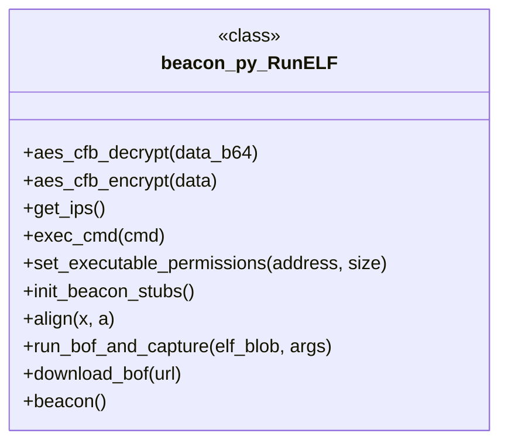

# Polyglot Codebase Knowledge Graph

> Generated offline by **readmenator**. 5 files, 33 symbols, 31 imports. Supports C, C++, Python, Go, Rust, JS/TS, Java, C#, Shell, PHP, Dart, GDScript, Nim, ASM, Ruby, Swift, Kotlin, Scala, Lua, Elixir.
> No LLMs. No tokens. Pure static analysis. See more [here](https://github.com/grisuno/ReadMenator)

**Start here:** Statistics Dashboard for scope, God Nodes for blast radius, Architecture Reference for per-file API. Agents: prefer `readmenator-agent/INDEX.md` + `SYMBOLS.md`.

**Wiki:** prefer `readmenator-wiki/index.md` for progressive disclosure: one synthesis page per community, `connections.json` with EXTRACTED vs INFERRED confidence, `queries.md` log, `REPORT.md` audit.

**Confidence:** EXTRACTED = parsed from source, INFERRED = heuristic bridge, AMBIGUOUS = reported, never hidden. See `readmenator-wiki/REPORT.md`.

**Total Files Parsed:** 5 | **Total Symbols Extracted:** 33 | **Total Imports:** 31

<!-- ranking_model: v1.0 | weights: {ppr:0.45,auth:0.2,test:0.15,doc:0.1,fresh:0.1} | alpha:0.85 | commit:1e0fd0b | date:2026-07-18 -->


## Table of Contents

1. [Statistics Dashboard](#statistics-dashboard)
2. [Architectural Layers](#architectural-layers)
3. [Ranked Context](#ranked-context)
4. [God Nodes](#god-nodes)
5. [Suggested Questions](#suggested-questions)
6. [Taint Propagation Map](#taint-propagation-map)
7. [Hotspot Analysis](#hotspot-analysis)
8. [Change Impact Analysis](#change-impact-analysis)
9. [Suggested Linting Rules](#suggested-linting-rules)
10. [Dataflow Analysis](#dataflow-analysis)
11. [Concept Graph](#concept-graph)
12. [Orphans](#orphans)
13. [Query Recipes](#query-recipes)
14. [Structural Knowledge Map](#structural-knowledge-map)
15. [UML Class Diagram](#uml-class-diagram)
16. [Code Property Graph](#code-property-graph)
17. [Architecture Reference](#architecture-reference)
    - [C (1 files)](#c-1-files)
    - [PY (3 files)](#py-3-files)
    - [SH (1 files)](#sh-1-files)

---

## Statistics Dashboard

| Metric | Value |
|--------|-------|
| Total Files | 5 |
| Total Symbols | 33 |
| Total Imports | 31 |
| Call Edges | 276 |
| Inheritance Edges | 0 |
| Languages | 3 |
| Avg Symbols/File | 6.6 |
| Avg Imports/File | 6.2 |

### Top Files by Import Count (Fan-Out)

| File | Imports | Symbols | Language |
|------|---------|---------|----------|
| `beacon.py` | 14 | 24 | py |
| `lazyown_minimal_c2.py` | 12 | 8 | py |
| `loader_wrapper.c` | 5 | 1 | c |

---

## Architectural Layers

Auto-detected from path patterns, naming conventions, and imported frameworks.

| Layer | Files |
|-------|-------|
| utility | 4 |
| presentation | 1 |

### utility

- `app.py` (py, 0 symbols)
- `beacon.py` (py, 24 symbols)
- `install.sh` (sh, 0 symbols)
- `loader_wrapper.c` (c, 1 symbols)

### presentation

- `lazyown_minimal_c2.py` (py, 8 symbols)

---

## Ranked Context

Files ranked by composite score for the current query context. The ranking combines Personalized PageRank (query relevance), global authority, test coverage, documentation coverage, and code freshness. Model: v1.0.

| Rank | File | Composite | PPR | Authority | Test | Doc |
|------|------|-----------|-----|-----------|------|-----|
| 1 | `app.py` | 0.1000 | 0.0000 | 0.0000 | 0.00 | 1.00 |
| 2 | `beacon.py` | 0.0625 | 0.0000 | 0.0000 | 0.00 | 0.62 |
| 3 | `lazyown_minimal_c2.py` | 0.0125 | 0.0000 | 0.0000 | 0.00 | 0.12 |
| 4 | `install.sh` | 0.0000 | 0.0000 | 0.0000 | 0.00 | 0.00 |
| 5 | `loader_wrapper.c` | 0.0000 | 0.0000 | 0.0000 | 0.00 | 0.00 |

---

## God Nodes

Most architecturally central files ranked by combined import/export degree and symbol richness.

| File | Score | Connections | PageRank |
|------|-------|-------------|----------|
| `beacon.py` | 2.4 | | 0.0000 |
| `lazyown_minimal_c2.py` | 0.8 | | 0.0000 |
| `loader_wrapper.c` | 0.1 | | 0.0000 |
| `app.py` | 0.0 | | 0.0000 |
| `install.sh` | 0.0 | | 0.0000 |

---

## Suggested Questions

Auto-generated exploration prompts based on graph structure:

- What does beacon.py depend on, and what depends on it? (0 connections)
- What does lazyown_minimal_c2.py depend on, and what depends on it? (0 connections)
- What does loader_wrapper.c depend on, and what depends on it? (0 connections)
- What is RunELF in beacon.py and how is it used?
- What is the overall architecture of this codebase?

---

## Taint Propagation Map

Taint analysis traces how dangerous imports propagate through the codebase via transitive dependencies. Source files import dangerous modules directly; sink files receive the danger indirectly.

**Taint Sources:** 1 | **Taint Sinks:** 1 | **Propagation Paths:** 2

- `beacon.py` imports `requests` (0 hop to `beacon.py`) [medium]
  Path: beacon.py
- `beacon.py` imports `subprocess` (0 hop to `beacon.py`) [high]
  Path: beacon.py

---

## Hotspot Analysis

Files ranked by combined complexity (symbol count) and centrality (connection count). High-scoring files are architecturally critical and may need refactoring attention.

| File | Complexity | Centrality | Combined | Symbols | Connections |
|------|-----------|------------|----------|---------|-------------|
| `app.py` | 0.000 | 0.000 | 0.000 | 0 | 0 |
| `beacon.py` | 1.000 | 1.000 | 1.000 | 24 | 14 |
| `lazyown_minimal_c2.py` | 0.333 | 0.857 | 0.648 | 8 | 12 |
| `install.sh` | 0.000 | 0.000 | 0.000 | 0 | 0 |
| `loader_wrapper.c` | 0.042 | 0.357 | 0.231 | 1 | 5 |

---

## Dataflow Analysis

Procedural intra-function dataflow findings (zero tokens, regex-based heuristics, all INFERRED). Each lead is grounded at file:line for manual review.

**1 findings** (UNCHECKED_ALLOC: 1).

| File | Function | Line | Kind | Variable | Description |
|------|----------|------|------|----------|-------------|
| `beacon.py` | `get_ips` | 105 | `UNCHECKED_ALLOC` | `s` | Result of allocator stored in `s` is never checked against NULL. |

---

## Concept Graph

Semantic second-brain layer: nouns are concept nodes, verbs are edges. Each noun maps atomically to a file set (EXTRACTED); each verb aggregates structural imports, calls, and inherits into consumes, invokes, extends, depends_on, or bridges (INFERRED).

**7 concepts, 0 relations.**

| Concept | Files | Mentions |
|---------|-------|----------|
| `beacon` | 2 | 8 |
| `bof` | 2 | 5 |
| `loader` | 2 | 5 |
| `con` | 2 | 2 |
| `decrypt` | 2 | 2 |
| `download` | 2 | 2 |
| `encrypt` | 2 | 2 |

### Dialectic Prompts

- Thesis: `beacon` centralizes 2 files; Antithesis: `con` pulls 2 files with 2 shared (Jaccard 1.00); Synthesis: should they merge, split by layer, or keep `bridges` explicit?
- Thesis: `beacon` centralizes 2 files; Antithesis: `decrypt` pulls 2 files with 2 shared (Jaccard 1.00); Synthesis: should they merge, split by layer, or keep `bridges` explicit?
- Thesis: `beacon` centralizes 2 files; Antithesis: `download` pulls 2 files with 2 shared (Jaccard 1.00); Synthesis: should they merge, split by layer, or keep `bridges` explicit?
- Thesis: `beacon` centralizes 2 files; Antithesis: `encrypt` pulls 2 files with 2 shared (Jaccard 1.00); Synthesis: should they merge, split by layer, or keep `bridges` explicit?
- Thesis: `bof` centralizes 2 files; Antithesis: `loader` pulls 2 files with 2 shared (Jaccard 1.00); Synthesis: should they merge, split by layer, or keep `bridges` explicit?
- Thesis: `con` centralizes 2 files; Antithesis: `decrypt` pulls 2 files with 2 shared (Jaccard 1.00); Synthesis: should they merge, split by layer, or keep `bridges` explicit?
- Thesis: `con` centralizes 2 files; Antithesis: `download` pulls 2 files with 2 shared (Jaccard 1.00); Synthesis: should they merge, split by layer, or keep `bridges` explicit?
- Thesis: `con` centralizes 2 files; Antithesis: `encrypt` pulls 2 files with 2 shared (Jaccard 1.00); Synthesis: should they merge, split by layer, or keep `bridges` explicit?
- Thesis: `decrypt` centralizes 2 files; Antithesis: `download` pulls 2 files with 2 shared (Jaccard 1.00); Synthesis: should they merge, split by layer, or keep `bridges` explicit?
- Thesis: `decrypt` centralizes 2 files; Antithesis: `encrypt` pulls 2 files with 2 shared (Jaccard 1.00); Synthesis: should they merge, split by layer, or keep `bridges` explicit?

---

## Change Impact Analysis

Files sorted by how many other files would be affected if they changed. High-impact files should be changed with caution.

| File | Direct Dependents | Transitive Dependents | Total Impact |
|------|------------------|----------------------|--------------|
| `app.py` | 0 | 0 | 0 |
| `beacon.py` | 0 | 0 | 0 |
| `install.sh` | 0 | 0 | 0 |
| `lazyown_minimal_c2.py` | 0 | 0 | 0 |
| `loader_wrapper.c` | 0 | 0 | 0 |

---

## Suggested Linting Rules

Automatically suggested linting and security rules based on patterns detected in the codebase. These can be exported as Semgrep rules using the `--export-rules` flag.

| Rule ID | Severity | Description | Language | Matches |
|---------|----------|-------------|----------|---------|
| `RM001` | info | Large number of functions in py: 31 total | py | 31 |
| `RM002` | info | Print statement found (consider logging instead) | python | 47 |

---

## Orphans

Files with no documentation or low connectivity. These are candidates for documentation investment or cleanup.

- `install.sh` (0 symbols, no doc)
- `loader_wrapper.c` (1 symbols, no doc)

---

## Query Recipes

Example queries you can run against this knowledge base using the ranking engine:

```
# Find files most relevant to a concept
readmenator query "Where is the import resolver implemented?"

# Rank files by relevance to a topic
readmenator query "How does documentation generation work?"

# Explain why a file ranks highly
readmenator query "explain readmenator/_documentation.py"

# Trace dependency paths with ranked context
readmenator query "path from CLI to exporter"
```

The ranking model uses the following signals:

- **Personalized PageRank** (45% weight): query-specific relevance via seed propagation
- **Global Authority** (20% weight): structural importance via standard PageRank
- **Test Coverage** (15% weight): fraction of symbols referenced in test files
- **Doc Coverage** (10% weight): presence of docstrings and file-level docs
- **Freshness** (10% weight): recent modification activity

Results include score decomposition and justification paths for each ranked item.

---

## Structural Knowledge Map

```mermaid
graph TD
    classDef mod fill:#1e1e1e,stroke:#ff6666,stroke-width:2px,color:#fff;
    classDef cls fill:#2d2d2d,stroke:#4ec9b0,stroke-width:2px,color:#fff;
    classDef fn fill:#333,stroke:#dcdcaa,stroke-width:1px,color:#dcdcaa;
    classDef ext fill:#111,stroke:#666,stroke-dasharray:5 5,color:#aaa;
    beacon_py["beacon.py (py)"]
    class beacon_py mod;
    beacon_py_aes_cfb_decrypt["aes_cfb_decrypt"]
    class beacon_py_aes_cfb_decrypt fn;
    beacon_py --> beacon_py_aes_cfb_decrypt
    beacon_py_aes_cfb_encrypt["aes_cfb_encrypt"]
    class beacon_py_aes_cfb_encrypt fn;
    beacon_py --> beacon_py_aes_cfb_encrypt
    beacon_py_get_ips["get_ips"]
    class beacon_py_get_ips fn;
    beacon_py --> beacon_py_get_ips
    beacon_py_exec_cmd["exec_cmd"]
    class beacon_py_exec_cmd fn;
    beacon_py --> beacon_py_exec_cmd
    beacon_py_set_executable_permissions["set_executable_permissions"]
    class beacon_py_set_executable_permissions fn;
    beacon_py --> beacon_py_set_executable_permissions
    lazyown_minimal_c2_py["lazyown_minimal_c2.py (py)"]
    class lazyown_minimal_c2_py mod;
    loader_wrapper_c["loader_wrapper.c (c)"]
    class loader_wrapper_c mod;
    app_py["app.py (py)"]
    class app_py mod;
    install_sh["install.sh (sh)"]
    class install_sh mod;
    ext_json["json"]
    class ext_json ext;
    beacon_py -.->|imports| ext_json
    ext_time["time"]
    class ext_time ext;
    beacon_py -.->|imports| ext_time
    ext_base64["base64"]
    class ext_base64 ext;
    beacon_py -.->|imports| ext_base64
    ext_socket["socket"]
    class ext_socket ext;
    beacon_py -.->|imports| ext_socket
    ext_platform["platform"]
    class ext_platform ext;
    beacon_py -.->|imports| ext_platform
    ext_requests["requests"]
    class ext_requests ext;
    beacon_py -.->|imports| ext_requests
    ext_subprocess["subprocess"]
    class ext_subprocess ext;
    beacon_py -.->|imports| ext_subprocess
    ext_random["random"]
    class ext_random ext;
    beacon_py -.->|imports| ext_random
    ext_pathlib["pathlib"]
    class ext_pathlib ext;
    beacon_py -.->|imports| ext_pathlib
    ext_ctypes["ctypes"]
    class ext_ctypes ext;
    beacon_py -.->|imports| ext_ctypes
    ext_struct["struct"]
    class ext_struct ext;
    beacon_py -.->|imports| ext_struct
    ext_os["os"]
    class ext_os ext;
    beacon_py -.->|imports| ext_os
    ext_sys["sys"]
    class ext_sys ext;
    beacon_py -.->|imports| ext_sys
    ext_cryptography_hazmat_primitives_ciphers["cryptography.hazmat.primitives.ciphers"]
    class ext_cryptography_hazmat_primitives_ciphers ext;
    beacon_py -.->|imports| ext_cryptography_hazmat_primitives_ciphers
    lazyown_minimal_c2_py -.->|imports| ext_os
    lazyown_minimal_c2_py -.->|imports| ext_json
    lazyown_minimal_c2_py -.->|imports| ext_base64
    ext_sqlite3["sqlite3"]
    class ext_sqlite3 ext;
    lazyown_minimal_c2_py -.->|imports| ext_sqlite3
    lazyown_minimal_c2_py -.->|imports| ext_time
    ext_ssl["ssl"]
    class ext_ssl ext;
    lazyown_minimal_c2_py -.->|imports| ext_ssl
    ext_logging["logging"]
    class ext_logging ext;
    lazyown_minimal_c2_py -.->|imports| ext_logging
    ext_flask["flask"]
    class ext_flask ext;
    lazyown_minimal_c2_py -.->|imports| ext_flask
    lazyown_minimal_c2_py -.->|imports| ext_cryptography_hazmat_primitives_ciphers
    ext_cryptography_hazmat_backends["cryptography.hazmat.backends"]
    class ext_cryptography_hazmat_backends ext;
    lazyown_minimal_c2_py -.->|imports| ext_cryptography_hazmat_backends
    lazyown_minimal_c2_py -.->|imports| ext_flask
    lazyown_minimal_c2_py -.->|imports| ext_sys
    ext_stdio_h["stdio.h"]
    class ext_stdio_h ext;
    loader_wrapper_c -.->|imports| ext_stdio_h
    ext_stdlib_h["stdlib.h"]
    class ext_stdlib_h ext;
    loader_wrapper_c -.->|imports| ext_stdlib_h
    ext_sys_mman_h["mman.h"]
    class ext_sys_mman_h ext;
    loader_wrapper_c -.->|imports| ext_sys_mman_h
    ext_stdint_h["stdint.h"]
    class ext_stdint_h ext;
    loader_wrapper_c -.->|imports| ext_stdint_h
    ext_string_h["string.h"]
    class ext_string_h ext;
    loader_wrapper_c -.->|imports| ext_string_h
```



---

## UML Class Diagram

Auto-generated Mermaid class diagram from parsed class-level symbols. Shows classes, structs, interfaces, traits, and their methods with inheritance and dependency relationships.



---

## Code Property Graph

Machine-readable Code Property Graph (CPG) in JSON-LD format. This block allows AI agents to parse the full structural graph without additional file reads. Compatible with GraphRAG pipelines.

```json
{"@context": "https://schema.org", "analysis": {"communities": [], "god_nodes": [{"node_id": "beacon.py", "score": 2.4}, {"node_id": "lazyown_minimal_c2.py", "score": 0.8}, {"node_id": "loader_wrapper.c", "score": 0.1}, {"node_id": "app.py", "score": 0.0}, {"node_id": "install.sh", "score": 0.0}], "surprising_connections": []}, "edges": [{"confidence": "EXTRACTED", "relation": "imports", "source": "beacon.py", "target": "json"}, {"confidence": "EXTRACTED", "relation": "imports", "source": "beacon.py", "target": "time"}, {"confidence": "EXTRACTED", "relation": "imports", "source": "beacon.py", "target": "base64"}, {"confidence": "EXTRACTED", "relation": "imports", "source": "beacon.py", "target": "socket"}, {"confidence": "EXTRACTED", "relation": "imports", "source": "beacon.py", "target": "platform"}, {"confidence": "EXTRACTED", "relation": "imports", "source": "beacon.py", "target": "requests"}, {"confidence": "EXTRACTED", "relation": "imports", "source": "beacon.py", "target": "subprocess"}, {"confidence": "EXTRACTED", "relation": "imports", "source": "beacon.py", "target": "random"}, {"confidence": "EXTRACTED", "relation": "imports", "source": "beacon.py", "target": "pathlib"}, {"confidence": "EXTRACTED", "relation": "imports", "source": "beacon.py", "target": "ctypes"}, {"confidence": "EXTRACTED", "relation": "imports", "source": "beacon.py", "target": "struct"}, {"confidence": "EXTRACTED", "relation": "imports", "source": "beacon.py", "target": "os"}, {"confidence": "EXTRACTED", "relation": "imports", "source": "beacon.py", "target": "sys"}, {"confidence": "EXTRACTED", "relation": "imports", "source": "beacon.py", "target": "cryptography.hazmat.primitives.ciphers"}, {"confidence": "EXTRACTED", "relation": "imports", "source": "lazyown_minimal_c2.py", "target": "os"}, {"confidence": "EXTRACTED", "relation": "imports", "source": "lazyown_minimal_c2.py", "target": "json"}, {"confidence": "EXTRACTED", "relation": "imports", "source": "lazyown_minimal_c2.py", "target": "base64"}, {"confidence": "EXTRACTED", "relation": "imports", "source": "lazyown_minimal_c2.py", "target": "sqlite3"}, {"confidence": "EXTRACTED", "relation": "imports", "source": "lazyown_minimal_c2.py", "target": "time"}, {"confidence": "EXTRACTED", "relation": "imports", "source": "lazyown_minimal_c2.py", "target": "ssl"}, {"confidence": "EXTRACTED", "relation": "imports", "source": "lazyown_minimal_c2.py", "target": "logging"}, {"confidence": "EXTRACTED", "relation": "imports", "source": "lazyown_minimal_c2.py", "target": "flask"}, {"confidence": "EXTRACTED", "relation": "imports", "source": "lazyown_minimal_c2.py", "target": "cryptography.hazmat.primitives.ciphers"}, {"confidence": "EXTRACTED", "relation": "imports", "source": "lazyown_minimal_c2.py", "target": "cryptography.hazmat.backends"}, {"confidence": "EXTRACTED", "relation": "imports", "source": "lazyown_minimal_c2.py", "target": "flask"}, {"confidence": "EXTRACTED", "relation": "imports", "source": "lazyown_minimal_c2.py", "target": "sys"}, {"confidence": "EXTRACTED", "relation": "imports", "source": "loader_wrapper.c", "target": "stdio.h"}, {"confidence": "EXTRACTED", "relation": "imports", "source": "loader_wrapper.c", "target": "stdlib.h"}, {"confidence": "EXTRACTED", "relation": "imports", "source": "loader_wrapper.c", "target": "sys/mman.h"}, {"confidence": "EXTRACTED", "relation": "imports", "source": "loader_wrapper.c", "target": "stdint.h"}, {"confidence": "EXTRACTED", "relation": "imports", "source": "loader_wrapper.c", "target": "string.h"}], "generator": "readmenator", "metadata": {"edge_count": 307, "file_count": 5, "language_count": 3, "symbol_count": 33}, "nodes": [{"doc": "app.py  Autor: Gris Iscomeback Correo electrónico: grisiscomeback[at]gmail[dot]com Fecha de creación: xx/xx/xxxx Licencia: GPL v3  Descripción:", "id": "app.py", "kind": "module", "label": "app.py", "language": "py", "sha256": "57b21bdb023585b8", "symbol_count": 0, "symbols": []}, {"doc": "Pure-Python ELF-ET_REL loader para BOFs tipo Cobalt-Strike x86-64, System-V relocations. Replica fielmente el comportamiento del beacon en C.", "id": "beacon.py", "kind": "module", "label": "beacon.py", "language": "py", "sha256": "6eed577be52681c6", "symbol_count": 24, "symbols": [{"kind": "function", "line": 87, "name": "aes_cfb_decrypt", "signature": "def aes_cfb_decrypt(data_b64)"}, {"kind": "function", "line": 94, "name": "aes_cfb_encrypt", "signature": "def aes_cfb_encrypt(data)"}, {"kind": "function", "line": 102, "name": "get_ips", "signature": "def get_ips()"}, {"kind": "function", "line": 113, "name": "exec_cmd", "signature": "def exec_cmd(cmd)"}, {"doc": "Establece los permisos R+W+X en una región de memoria.\nDebe ser llamada después de mapear/cargar la sección de código.", "kind": "function", "line": 120, "name": "set_executable_permissions", "signature": "def set_executable_permissions(address, size)"}, {"kind": "function", "line": 162, "name": "init_beacon_stubs", "signature": "def init_beacon_stubs()"}, {"doc": "Alinear x al múltiplo superior de a", "kind": "function", "line": 210, "name": "align", "signature": "def align(x, a)"}, {"doc": "Loader ELF ET_REL (relocable) para ejecutar BOFs en Python.\nSigue la arquitectura de 4 fases del loader C funcional.", "kind": "class", "line": 215, "name": "RunELF", "signature": "class RunELF"}, {"kind": "method", "line": 612, "name": "run_bof_and_capture", "signature": "def run_bof_and_capture(elf_blob, args)"}, {"kind": "method", "line": 628, "name": "download_bof", "signature": "def download_bof(url)"}, {"kind": "method", "line": 640, "name": "beacon", "signature": "def beacon()"}, {"kind": "method", "line": 170, "name": "BeaconPrintf_stub", "signature": "def BeaconPrintf_stub(_type, fmt)"}, {"kind": "method", "line": 185, "name": "BeaconOutput_stub", "signature": "def BeaconOutput_stub(_type, data, length)"}, {"doc": "Parsear cabeceras ELF y preparar estructuras.\n\nArgs:\n    blob: Bytes del archivo ELF relocable (.o)", "kind": "method", "line": 221, "name": "__init__", "signature": "def __init__(self, blob)"}, {"doc": "Leer una section header por índice.\n\nReturns:\n    tuple: (sh_name, sh_type, sh_flags, sh_addr, sh_offset, sh_size,\n           sh_link, sh_info, sh_addralign, sh_entsize)", "kind": "method", "line": 257, "name": "_shdr", "signature": "def _shdr(self, idx)"}, {"doc": "Encontrar índices de las secciones SHT_SYMTAB y SHT_STRTAB.\n\nReturns:\n    tuple: (symtab_idx, strtab_idx)", "kind": "method", "line": 269, "name": "_find_sym_str", "signature": "def _find_sym_str(self)"}, {"doc": "FASE 1: Pre-resolver TODOS los símbolos externos antes de mapear secciones.\nEsto evita problemas de resolución en tiempo de relocalización.", "kind": "method", "line": 297, "name": "_preresolve_external_symbols", "signature": "def _preresolve_external_symbols(self)"}, {"doc": "Cargar y preparar el ELF para ejecución.\n\nFases:\n1. Pre-resolver símbolos externos\n2. Mapear secciones como RW (sin EXEC)\n3. Aplicar relocalizaciones\n4. Cambiar permisos a RX (W^X enforcement)", "kind": "method", "line": 363, "name": "load", "signature": "def load(self)"}, {"doc": "Aplicar todas las relocalizaciones usando símbolos pre-resueltos,\ncon logging detallado.", "kind": "method", "line": 427, "name": "_reloc", "signature": "def _reloc(self)"}, {"doc": "Obtener el valor (dirección) de un símbolo por su índice.\n\nArgs:\n    idx: Índice del símbolo en la tabla de símbolos\n    \nReturns:\n    int: Dirección del símbolo", "kind": "method", "line": 490, "name": "_get_symbol_value", "signature": "def _get_symbol_value(self, idx)"}, {"doc": "Buscar un símbolo por nombre.\n\nArgs:\n    name: Nombre del símbolo (bytes)\n    \nReturns:\n    int or None: Índice del símbolo, o None si no se encuentra", "kind": "method", "line": 529, "name": "_find_sym", "signature": "def _find_sym(self, name)"}, {"doc": "Ejecuta el BOF delegando la llamada a la librería C externa 'libbofloader.so',\nque se encarga del aislamiento de stack de forma segura.", "kind": "method", "line": 552, "name": "run", "signature": "def run(self, func, args)"}, {"doc": "Liberar todas las secciones mapeadas.\nDebe ser llamado cuando el BOF ya no sea necesario.", "kind": "method", "line": 589, "name": "cleanup", "signature": "def cleanup(self)"}, {"doc": "Destructor: limpiar memoria automáticamente", "kind": "method", "line": 603, "name": "__del__", "signature": "def __del__(self)"}]}, {"id": "install.sh", "kind": "module", "label": "install.sh", "language": "sh", "sha256": "c907d80fd6734993", "symbol_count": 0, "symbols": []}, {"doc": "LazyOwn C2 solo beacon (compatible con beacons anteriores) argv: <puerto> <usuario> <contraseña>", "id": "lazyown_minimal_c2.py", "kind": "module", "label": "lazyown_minimal_c2.py", "language": "py", "sha256": "d3138f1135f4c5de", "symbol_count": 8, "symbols": [{"kind": "function", "line": 22, "name": "encrypt_data", "signature": "def encrypt_data(data)"}, {"kind": "function", "line": 28, "name": "decrypt_data", "signature": "def decrypt_data(b64data, is_file)"}, {"kind": "function", "line": 36, "name": "init_db", "signature": "def init_db()"}, {"kind": "function", "line": 50, "name": "send_command", "signature": "def send_command(client_id)"}, {"kind": "function", "line": 55, "name": "recv_result", "signature": "def recv_result(client_id)"}, {"kind": "function", "line": 70, "name": "upload", "signature": "def upload()"}, {"kind": "function", "line": 81, "name": "download", "signature": "def download(filename)"}, {"kind": "function", "line": 91, "name": "panel", "signature": "def panel()"}]}, {"id": "loader_wrapper.c", "kind": "module", "label": "loader_wrapper.c", "language": "c", "sha256": "5304fb21e66a7f00", "symbol_count": 1, "symbols": [{"kind": "function", "line": 9, "name": "execute_bof", "signature": "void execute_bof(void* go_addr, char* args, int len)"}]}], "type": "CodePropertyGraph", "version": "1.0"}
```

---

## Architecture Reference

### C (1 files)

#### `loader_wrapper.c`
**Path:** `loader_wrapper.c`

**Functions:**
- `execute_bof` (line 9) `void execute_bof(void* go_addr, char* args, int len)`

### PY (3 files)

#### `app.py`
**Path:** `app.py`
**File Doc:** *app.py  Autor: Gris Iscomeback Correo electrónico: grisiscomeback[at]gmail[dot]com Fecha de creación: xx/xx/xxxx Licencia: GPL v3  Descripción:*

*No symbols extracted*

#### `beacon.py`
**Path:** `beacon.py`
**File Doc:** *Pure-Python ELF-ET_REL loader para BOFs tipo Cobalt-Strike x86-64, System-V relocations. Replica fielmente el comportamiento del beacon en C.*

**Classes:**
- `RunELF` (line 215) `class RunELF` - *Loader ELF ET_REL (relocable) para ejecutar BOFs en Python.
Sigue la arquitectura de 4 fases del loader C funcional.*

**Functions:**
- `aes_cfb_decrypt` (line 87) `def aes_cfb_decrypt(data_b64)`
- `aes_cfb_encrypt` (line 94) `def aes_cfb_encrypt(data)`
- `get_ips` (line 102) `def get_ips()`
- `exec_cmd` (line 113) `def exec_cmd(cmd)`
- `set_executable_permissions` (line 120) `def set_executable_permissions(address, size)` - *Establece los permisos R+W+X en una región de memoria.
Debe ser llamada después de mapear/cargar la sección de código.*
- `init_beacon_stubs` (line 162) `def init_beacon_stubs()`
- `align` (line 210) `def align(x, a)` - *Alinear x al múltiplo superior de a*

**Methods:**
- `run_bof_and_capture` (line 612) `def run_bof_and_capture(elf_blob, args)`
- `download_bof` (line 628) `def download_bof(url)`
- `beacon` (line 640) `def beacon()`
- `BeaconPrintf_stub` (line 170) `def BeaconPrintf_stub(_type, fmt)`
- `BeaconOutput_stub` (line 185) `def BeaconOutput_stub(_type, data, length)`
- `__init__` (line 221) `def __init__(self, blob)` - *Parsear cabeceras ELF y preparar estructuras.

Args:
    blob: Bytes del archivo ELF relocable (.o)*
- `_shdr` (line 257) `def _shdr(self, idx)` - *Leer una section header por índice.

Returns:
    tuple: (sh_name, sh_type, sh_flags, sh_addr, sh_offset, sh_size,
           sh_link, sh_info, sh_addralign, sh_entsize)*
- `_find_sym_str` (line 269) `def _find_sym_str(self)` - *Encontrar índices de las secciones SHT_SYMTAB y SHT_STRTAB.

Returns:
    tuple: (symtab_idx, strtab_idx)*
- `_preresolve_external_symbols` (line 297) `def _preresolve_external_symbols(self)` - *FASE 1: Pre-resolver TODOS los símbolos externos antes de mapear secciones.
Esto evita problemas de resolución en tiempo de relocalización.*
- `load` (line 363) `def load(self)` - *Cargar y preparar el ELF para ejecución.

Fases:
1. Pre-resolver símbolos externos
2. Mapear secciones como RW (sin EXEC)
3. Aplicar relocalizaciones
4. Cambiar permisos a RX (W^X enforcement)*
- `_reloc` (line 427) `def _reloc(self)` - *Aplicar todas las relocalizaciones usando símbolos pre-resueltos,
con logging detallado.*
- `_get_symbol_value` (line 490) `def _get_symbol_value(self, idx)` - *Obtener el valor (dirección) de un símbolo por su índice.

Args:
    idx: Índice del símbolo en la tabla de símbolos
    
Returns:
    int: Dirección del símbolo*
- `_find_sym` (line 529) `def _find_sym(self, name)` - *Buscar un símbolo por nombre.

Args:
    name: Nombre del símbolo (bytes)
    
Returns:
    int or None: Índice del símbolo, o None si no se encuentra*
- `run` (line 552) `def run(self, func, args)` - *Ejecuta el BOF delegando la llamada a la librería C externa 'libbofloader.so',
que se encarga del aislamiento de stack de forma segura.*
- `cleanup` (line 589) `def cleanup(self)` - *Liberar todas las secciones mapeadas.
Debe ser llamado cuando el BOF ya no sea necesario.*
- `__del__` (line 603) `def __del__(self)` - *Destructor: limpiar memoria automáticamente*

#### `lazyown_minimal_c2.py`
**Path:** `lazyown_minimal_c2.py`
**File Doc:** *LazyOwn C2 solo beacon (compatible con beacons anteriores) argv: <puerto> <usuario> <contraseña>*

**Functions:**
- `encrypt_data` (line 22) `def encrypt_data(data)`
- `decrypt_data` (line 28) `def decrypt_data(b64data, is_file)`
- `init_db` (line 36) `def init_db()`
- `send_command` (line 50) `def send_command(client_id)`
- `recv_result` (line 55) `def recv_result(client_id)`
- `upload` (line 70) `def upload()`
- `download` (line 81) `def download(filename)`
- `panel` (line 91) `def panel()`

### SH (1 files)

#### `install.sh`
**Path:** `install.sh`

*No symbols extracted*
