# Polyglot Codebase Knowledge Graph

> Generated offline by **readmenator**. Supports C, C++, Python, Go, Rust, JS/TS, Java, C#, Shell, PHP, Dart, GDScript, Nim, ASM.
> No LLMs. No tokens. Pure static analysis. See more [here](https://github.com/grisuno/ReadMenator)

**Total Files Parsed:** 5 | **Total Symbols Extracted:** 33 | **Total Imports:** 31

## Structural Knowledge Map

```mermaid
graph TD
    classDef mod fill:#1e1e1e,stroke:#ff6666,stroke-width:2px,color:#fff;
    classDef cls fill:#2d2d2d,stroke:#4ec9b0,stroke-width:2px,color:#fff;
    classDef fn fill:#333,stroke:#dcdcaa,stroke-width:1px,color:#dcdcaa;
    classDef ext fill:#111,stroke:#666,stroke-dasharray:5 5,color:#aaa;
    beacon_py["beacon.py (py)"]
    class beacon_py mod;
    beacon_py_aes_cfb_decrypt["aes_cfb_decrypt"]
    class beacon_py_aes_cfb_decrypt fn;
    beacon_py --> beacon_py_aes_cfb_decrypt
    beacon_py_aes_cfb_encrypt["aes_cfb_encrypt"]
    class beacon_py_aes_cfb_encrypt fn;
    beacon_py --> beacon_py_aes_cfb_encrypt
    beacon_py_get_ips["get_ips"]
    class beacon_py_get_ips fn;
    beacon_py --> beacon_py_get_ips
    beacon_py_exec_cmd["exec_cmd"]
    class beacon_py_exec_cmd fn;
    beacon_py --> beacon_py_exec_cmd
    beacon_py_set_executable_permissions["set_executable_permissions"]
    class beacon_py_set_executable_permissions fn;
    beacon_py --> beacon_py_set_executable_permissions
    lazyown_minimal_c2_py["lazyown_minimal_c2.py (py)"]
    class lazyown_minimal_c2_py mod;
    lazyown_minimal_c2_py_encrypt_data["encrypt_data"]
    class lazyown_minimal_c2_py_encrypt_data fn;
    lazyown_minimal_c2_py --> lazyown_minimal_c2_py_encrypt_data
    lazyown_minimal_c2_py_decrypt_data["decrypt_data"]
    class lazyown_minimal_c2_py_decrypt_data fn;
    lazyown_minimal_c2_py --> lazyown_minimal_c2_py_decrypt_data
    lazyown_minimal_c2_py_init_db["init_db"]
    class lazyown_minimal_c2_py_init_db fn;
    lazyown_minimal_c2_py --> lazyown_minimal_c2_py_init_db
    lazyown_minimal_c2_py_send_command["send_command"]
    class lazyown_minimal_c2_py_send_command fn;
    lazyown_minimal_c2_py --> lazyown_minimal_c2_py_send_command
    lazyown_minimal_c2_py_recv_result["recv_result"]
    class lazyown_minimal_c2_py_recv_result fn;
    lazyown_minimal_c2_py --> lazyown_minimal_c2_py_recv_result
    loader_wrapper_c["loader_wrapper.c (c)"]
    class loader_wrapper_c mod;
    loader_wrapper_c_execute_bof["execute_bof"]
    class loader_wrapper_c_execute_bof fn;
    loader_wrapper_c --> loader_wrapper_c_execute_bof
    app_py["app.py (py)"]
    class app_py mod;
    install_sh["install.sh (sh)"]
    class install_sh mod;
    ext_json["json"]
    class ext_json ext;
    beacon_py -.->|imports| ext_json
    ext_time["time"]
    class ext_time ext;
    beacon_py -.->|imports| ext_time
    ext_base64["base64"]
    class ext_base64 ext;
    beacon_py -.->|imports| ext_base64
    ext_socket["socket"]
    class ext_socket ext;
    beacon_py -.->|imports| ext_socket
    ext_platform["platform"]
    class ext_platform ext;
    beacon_py -.->|imports| ext_platform
    ext_requests["requests"]
    class ext_requests ext;
    beacon_py -.->|imports| ext_requests
    ext_subprocess["subprocess"]
    class ext_subprocess ext;
    beacon_py -.->|imports| ext_subprocess
    ext_random["random"]
    class ext_random ext;
    beacon_py -.->|imports| ext_random
    ext_pathlib["pathlib"]
    class ext_pathlib ext;
    beacon_py -.->|imports| ext_pathlib
    ext_ctypes["ctypes"]
    class ext_ctypes ext;
    beacon_py -.->|imports| ext_ctypes
    ext_struct["struct"]
    class ext_struct ext;
    beacon_py -.->|imports| ext_struct
    ext_os["os"]
    class ext_os ext;
    beacon_py -.->|imports| ext_os
    ext_sys["sys"]
    class ext_sys ext;
    beacon_py -.->|imports| ext_sys
    ext_cryptography_hazmat_primitives_ciphers["cryptography.hazmat.primitives.ciphers"]
    class ext_cryptography_hazmat_primitives_ciphers ext;
    beacon_py -.->|imports| ext_cryptography_hazmat_primitives_ciphers
    lazyown_minimal_c2_py -.->|imports| ext_os
    lazyown_minimal_c2_py -.->|imports| ext_json
    lazyown_minimal_c2_py -.->|imports| ext_base64
    ext_sqlite3["sqlite3"]
    class ext_sqlite3 ext;
    lazyown_minimal_c2_py -.->|imports| ext_sqlite3
    lazyown_minimal_c2_py -.->|imports| ext_time
    ext_ssl["ssl"]
    class ext_ssl ext;
    lazyown_minimal_c2_py -.->|imports| ext_ssl
    ext_logging["logging"]
    class ext_logging ext;
    lazyown_minimal_c2_py -.->|imports| ext_logging
    ext_flask["flask"]
    class ext_flask ext;
    lazyown_minimal_c2_py -.->|imports| ext_flask
    lazyown_minimal_c2_py -.->|imports| ext_cryptography_hazmat_primitives_ciphers
    ext_cryptography_hazmat_backends["cryptography.hazmat.backends"]
    class ext_cryptography_hazmat_backends ext;
    lazyown_minimal_c2_py -.->|imports| ext_cryptography_hazmat_backends
    lazyown_minimal_c2_py -.->|imports| ext_flask
    lazyown_minimal_c2_py -.->|imports| ext_sys
    ext_stdio_h["stdio.h"]
    class ext_stdio_h ext;
    loader_wrapper_c -.->|imports| ext_stdio_h
    ext_stdlib_h["stdlib.h"]
    class ext_stdlib_h ext;
    loader_wrapper_c -.->|imports| ext_stdlib_h
    ext_sys_mman_h["mman.h"]
    class ext_sys_mman_h ext;
    loader_wrapper_c -.->|imports| ext_sys_mman_h
    ext_stdint_h["stdint.h"]
    class ext_stdint_h ext;
    loader_wrapper_c -.->|imports| ext_stdint_h
    ext_string_h["string.h"]
    class ext_string_h ext;
    loader_wrapper_c -.->|imports| ext_string_h
```

---

## Architecture Reference

### C (1 files)

#### `loader_wrapper.c`
**Path:** `loader_wrapper.c`

**Functions:**
- `execute_bof` (line 8) `void execute_bof(void* go_addr, char* args, int len)`

### PY (3 files)

#### `app.py`
**Path:** `app.py`

*No symbols extracted*

#### `beacon.py`
**Path:** `beacon.py`

**Classes:**
- `RunELF` (line 215) `class RunELF` - *Loader ELF ET_REL (relocable) para ejecutar BOFs en Python.
Sigue la arquitectura de 4 fases del loader C funcional.*

**Functions:**
- `aes_cfb_decrypt` (line 87) `def aes_cfb_decrypt(data_b64)`
- `aes_cfb_encrypt` (line 94) `def aes_cfb_encrypt(data)`
- `get_ips` (line 102) `def get_ips()`
- `exec_cmd` (line 113) `def exec_cmd(cmd)`
- `set_executable_permissions` (line 120) `def set_executable_permissions(address, size)` - *Establece los permisos R+W+X en una región de memoria.
Debe ser llamada después de mapear/cargar la sección de código.*
- `init_beacon_stubs` (line 162) `def init_beacon_stubs()`
- `align` (line 210) `def align(x, a)` - *Alinear x al múltiplo superior de a*
- `run_bof_and_capture` (line 612) `def run_bof_and_capture(elf_blob, args)`
- `download_bof` (line 628) `def download_bof(url)`
- `beacon` (line 640) `def beacon()`
- `BeaconPrintf_stub` (line 170) `def BeaconPrintf_stub(_type, fmt)`
- `BeaconOutput_stub` (line 185) `def BeaconOutput_stub(_type, data, length)`
- `__init__` (line 221) `def __init__(self, blob)` - *Parsear cabeceras ELF y preparar estructuras.

Args:
    blob: Bytes del archivo ELF relocable (.o)*
- `_shdr` (line 257) `def _shdr(self, idx)` - *Leer una section header por índice.

Returns:
    tuple: (sh_name, sh_type, sh_flags, sh_addr, sh_offset, sh_size,
           sh_link, sh_info, sh_addralign, sh_entsize)*
- `_find_sym_str` (line 269) `def _find_sym_str(self)` - *Encontrar índices de las secciones SHT_SYMTAB y SHT_STRTAB.

Returns:
    tuple: (symtab_idx, strtab_idx)*
- `_preresolve_external_symbols` (line 297) `def _preresolve_external_symbols(self)` - *FASE 1: Pre-resolver TODOS los símbolos externos antes de mapear secciones.
Esto evita problemas de resolución en tiempo de relocalización.*
- `load` (line 363) `def load(self)` - *Cargar y preparar el ELF para ejecución.

Fases:
1. Pre-resolver símbolos externos
2. Mapear secciones como RW (sin EXEC)
3. Aplicar relocalizaciones
4. Cambiar permisos a RX (W^X enforcement)*
- `_reloc` (line 427) `def _reloc(self)` - *Aplicar todas las relocalizaciones usando símbolos pre-resueltos,
con logging detallado.*
- `_get_symbol_value` (line 490) `def _get_symbol_value(self, idx)` - *Obtener el valor (dirección) de un símbolo por su índice.

Args:
    idx: Índice del símbolo en la tabla de símbolos
    
Returns:
    int: Dirección del símbolo*
- `_find_sym` (line 529) `def _find_sym(self, name)` - *Buscar un símbolo por nombre.

Args:
    name: Nombre del símbolo (bytes)
    
Returns:
    int or None: Índice del símbolo, o None si no se encuentra*
- `run` (line 552) `def run(self, func, args)` - *Ejecuta el BOF delegando la llamada a la librería C externa 'libbofloader.so',
que se encarga del aislamiento de stack de forma segura.*
- `cleanup` (line 589) `def cleanup(self)` - *Liberar todas las secciones mapeadas.
Debe ser llamado cuando el BOF ya no sea necesario.*
- `__del__` (line 603) `def __del__(self)` - *Destructor: limpiar memoria automáticamente*

#### `lazyown_minimal_c2.py`
**Path:** `lazyown_minimal_c2.py`

**Functions:**
- `encrypt_data` (line 22) `def encrypt_data(data)`
- `decrypt_data` (line 28) `def decrypt_data(b64data, is_file)`
- `init_db` (line 36) `def init_db()`
- `send_command` (line 50) `def send_command(client_id)`
- `recv_result` (line 55) `def recv_result(client_id)`
- `upload` (line 70) `def upload()`
- `download` (line 81) `def download(filename)`
- `panel` (line 91) `def panel()`

### SH (1 files)

#### `install.sh`
**Path:** `install.sh`

*No symbols extracted*
